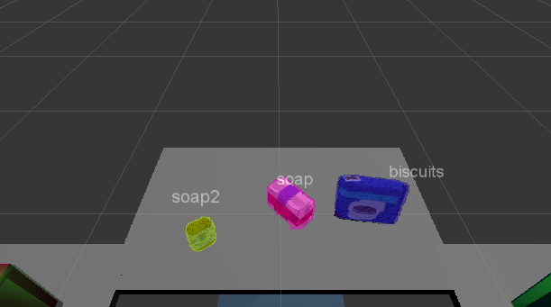
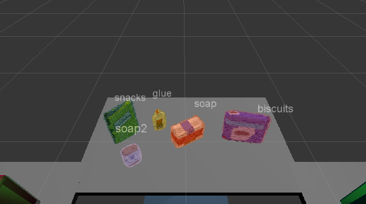

## Project: Perception Pick & Place

[//]: # (Image References)

[ConfusionMatrixLinear]: ./misc_images/ConfusionMatrixLinear.png
[ConfusionMatrixRBF]: ./misc_images/ConfusionMatrixRBF.png
[ConfusionMatrixW1_v2]: ./misc_images/ConfusionMatrix_m1_v2.png
[NConfusionMatrixW1_v2]: ./misc_images/NConfunsionMatrix_m1_v2.png
[W1]: ./misc_images/W1.png

In this project, we will be working with different techniques which will help us to recognize
diferent objects. First, several filtering algorithms will be implemented to deal with the original 
point cloud and obtain the one for each object. Later, analysing these point clouds with a
SVN model, we will be able to identify each object.

### Exercise 1, 2 and 3 pipeline implemented
#### 1. Complete Exercise 1 steps. Pipeline for filtering and RANSAC plane fitting implemented.
In this section several filtering techniques are applied to our point cloud. Our RGB-D camera will provide
 the point cloud with noise which will be removed by applying the statistical outliner filter. Next, data will
 be downsampled in order to improve computational cost. To achieve so, the Voxel Grid Downsampling Filter
 will be applied. Later, two passthrough filters will be implemented to remove useless data from our point 
 cloud. Once we have our table with the objects of interest, it is useful to separe our table from other 
 objects. To do this, the Radom Sample Consensus or "RANSAC" technique will identify the elements which belong 
 to a plane, in this case, our table. 
 
* Statistical outliner filter

```
    # Statistical Outlier Filtering
    # Filter object: 
    outlier_filter = cloud.make_statistical_outlier_filter()

    # Set the number of neighboring points to analyze for any given point
    outlier_filter.set_mean_k(10)

    # Set threshold scale factor
    x = 0.01

    # Any point with a mean distance larger than global (mean distance +x*std_dev) will be considered outlier
    outlier_filter.set_std_dev_mul_thresh(x)

    # Finally call the filter function for magic
    cloud_filtered = outlier_filter.filter()
```

* Voxel Grid Downsampling filter

```
    # Voxel Grid Downsampling
    vox = cloud_filtered.make_voxel_grid_filter()
    LEAF_SIZE = 0.005
    vox.set_leaf_size(LEAF_SIZE, LEAF_SIZE, LEAF_SIZE)
    cloud_filtered = vox.filter()
```

* PassThrough filter Z

```
    # PassThrough Filter Z
    passthrough = cloud_filtered.make_passthrough_filter()
    # Assign axis and range to the passthrough filter object.
    filter_axis = 'z'
    passthrough.set_filter_field_name(filter_axis)
    axis_min = 0.61
    axis_max = 1.1
    passthrough.set_filter_limits(axis_min, axis_max)
    cloud_filtered = passthrough.filter()
```

* PassThrough filter Y

```
    # PassThrough Filter Y
    passthrough = cloud_filtered.make_passthrough_filter()
    # Assign axis and range to the passthrough filter object.
    filter_axis = 'y'
    passthrough.set_filter_field_name(filter_axis)
    axis_min = -0.45
    axis_max = 0.45
    passthrough.set_filter_limits(axis_min, axis_max)
    cloud_filtered = passthrough.filter()
```

* RANSAC Plane Segmentation

 ```
    # RANSAC Plane Segmentation
    seg = cloud_filtered.make_segmenter()
    seg.set_model_type(pcl.SACMODEL_PLANE) 
    seg.set_method_type(pcl.SAC_RANSAC)
    max_distance = 0.015
    seg.set_distance_threshold(max_distance)
```


#### 2. Complete Exercise 2 steps: Pipeline including clustering for segmentation implemented.  
Up to this point we have the objects and the table in two point clouds. The table can be ruled out, but we need to separate the objects
to be able to identify each one. In order to achive so, Euclidean Clustering technique will be applied.


 ```
    # Euclidean Clustering
    white_cloud = XYZRGB_to_XYZ(cloud_objects)
    tree = white_cloud.make_kdtree()
    # Create a cluster extraction object
    ec = white_cloud.make_EuclideanClusterExtraction()
    # Set tolerances for distance threshold 
    # as well as minimum and maximum cluster size (in points)
    # NOTE: These are poor choices of clustering parameters
    # Your task is to experiment and find values that work for segmenting objects.
    ec.set_ClusterTolerance(0.01)
    ec.set_MinClusterSize(50)
    ec.set_MaxClusterSize(3000)
    # Search the k-d tree for clusters
    ec.set_SearchMethod(tree)
    # Extract indices for each of the discovered clusters
    cluster_indices = ec.Extract()

```

Now that we have the clusters we will create a Cluster-Mask Point Cloud to visualize each cluster separately.

 ```
    # Create Cluster-Mask Point Cloud to visualize each cluster separately
    #Assign a color corresponding to each segmented object in scene
    cluster_color = get_color_list(len(cluster_indices))

    color_cluster_point_list = []

    for j, indices in enumerate(cluster_indices):
        for i, indice in enumerate(indices):
            color_cluster_point_list.append([white_cloud[indice][0],
                                            white_cloud[indice][1],
                                            white_cloud[indice][2],
                                             rgb_to_float(cluster_color[j])])

    #Create new cloud containing all clusters, each with unique color
    cluster_cloud = pcl.PointCloud_PointXYZRGB()
    cluster_cloud.from_list(color_cluster_point_list)

```


#### 2. Complete Exercise 3 Steps.  Features extracted and SVM trained.  Object recognition implemented.
In this section, we are going to associate each cloud point with the object that it represents. To do so we
will use the Support Vector Machine or "SVM", which is a supervised machine learning algorithm that allows you to characterize
 the parameter space of your dataset into discrete classes.
 
First we need to generate a training set of features for the pickable objects. To create that training
the models in capture_features.py have been modified. To improve the model accuracy the number of poses 
have been set to 200.

 ```
models = [\
       'biscuits',
       'book',
       'eraser',
       'glue',
       'soap',
       'soap2',
       'sticky_notes',
       'snacks']

```
Below compute_color_histograms and compute_normal_histograms functions have been included. It can be
seen that 64 bins have been defined to carry out both histograms.
```
def compute_color_histograms(cloud, using_hsv=False):

    # Compute histograms for the clusters
    point_colors_list = []

    # Step through each point in the point cloud
    for point in pc2.read_points(cloud, skip_nans=True):
        rgb_list = float_to_rgb(point[3])
        if using_hsv:
            point_colors_list.append(rgb_to_hsv(rgb_list) * 255)
        else:
            point_colors_list.append(rgb_list)

    # Populate lists with color values
    channel_1_vals = []
    channel_2_vals = []
    channel_3_vals = []

    for color in point_colors_list:
        channel_1_vals.append(color[0])
        channel_2_vals.append(color[1])
        channel_3_vals.append(color[2])
    
    # Compute histograms
    channel_1_hist = np.histogram(channel_1_vals, bins=64, range=(0, 256))
    channel_2_hist = np.histogram(channel_2_vals, bins=64, range=(0, 256))
    channel_3_hist = np.histogram(channel_3_vals, bins=64, range=(0, 256))

    # Concatenate and normalize the histograms
    hist_features = np.concatenate((channel_1_hist[0], channel_2_hist[0], channel_3_hist[0])).astype(np.float64)
    normed_features = hist_features / np.sum(hist_features)

    return normed_features 

```
```
def compute_normal_histograms(normal_cloud):
    norm_x_vals = []
    norm_y_vals = []
    norm_z_vals = []

    for norm_component in pc2.read_points(normal_cloud,
                                          field_names = ('normal_x', 'normal_y', 'normal_z'),
                                          skip_nans=True):
        norm_x_vals.append(norm_component[0])
        norm_y_vals.append(norm_component[1])
        norm_z_vals.append(norm_component[2])

    # Compute histograms of normal values (just like with color)
    norm_x_hist = np.histogram(norm_x_vals, bins=64, range=(-1, 1))
    norm_y_hist = np.histogram(norm_y_vals, bins=64, range=(-1, 1))
    norm_z_hist = np.histogram(norm_z_vals, bins=64, range=(-1, 1))

    # Concatenate and normalize the histograms
    hist_features = np.concatenate((norm_x_hist[0], norm_y_hist[0], norm_z_hist[0])).astype(np.float64)
    normed_features = hist_features / np.sum(hist_features)

    return normed_features
	
```
Once obtained the training set, we train our SVM model. Two different SVM kernels have been tested linear and
 RFB. Below are depicted the confusion matrices for each kernel.
 
 Confusion matrix with linear kernel
![Confusion Matrix Linear][ConfusionMatrixLinear]

 Confusion matrix with rbf kernel
![Confusion Matrix RBF][ConfusionMatrixRBF]

Considering that with any of the previous models the objects were identified correctly, another model was generated
in order to improve its accuracy. In this case, three objects were included when creating the model for the first world.
The confusion matrices obtained are shown below.


Although the obtained accuracy was really good with those models, they didn't achieve the recognition task correctly.
Thus, the kernel RBF was changed to linear, although we lost accuracy in the confusion matrix, the model performed 
considerably better.

### Pick and Place Setup

#### 1. For all three tabletop setups (`test*.world`), perform object recognition, then read in respective pick list (`pick_list_*.yaml`). Next construct the messages that would comprise a valid `PickPlace` request output them to `.yaml` format.
As it can be seen 3/3(100%) objects are recognised in test case 1, 4/5(80%) in test case 2 and 6/8(75%) in test case 3.






It has been observed that the accuracy provided by the program train_svm.py is not a good measure of how well
the model works. Indeed, I was in a point were objects were not recognised and, as seen before, the accuracy was really good,
in that moment I thought that there was a bug in my code. However, it turned out to be caused by the RBF kernel. 
When it was set to linear everything started to work.

As for parameters, it has been observed that the number of bins is crucial. If it is set too high the performance of
the model decrease. Three values have been implemented: 32,64 and 128, and the first one has provided better results.
The number of poses is also really important. In this case, the same behaviour has been observed, there is a middle value,
in this case 150, for which the model works quite well. The overall performance could be improved by carrying out a fine tune.